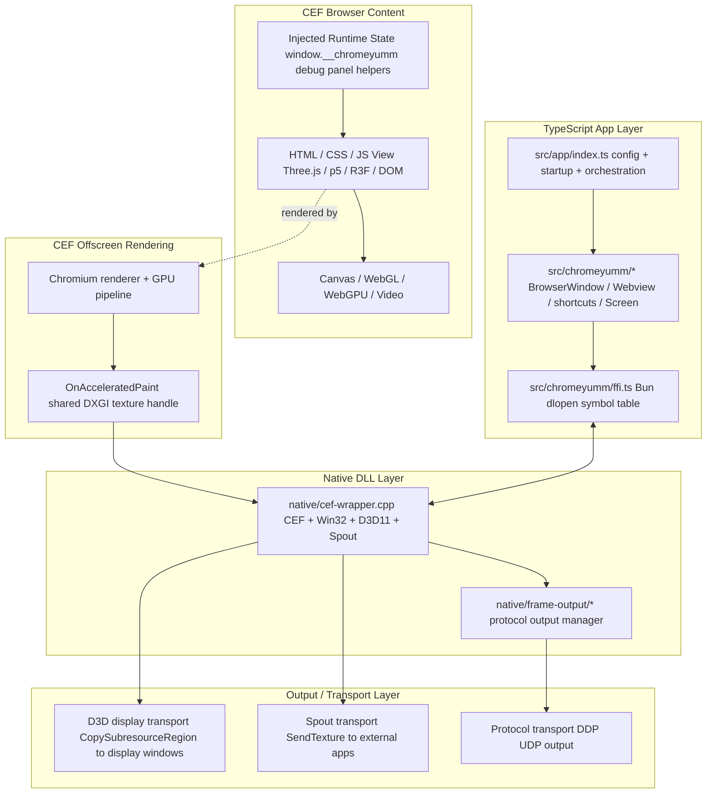
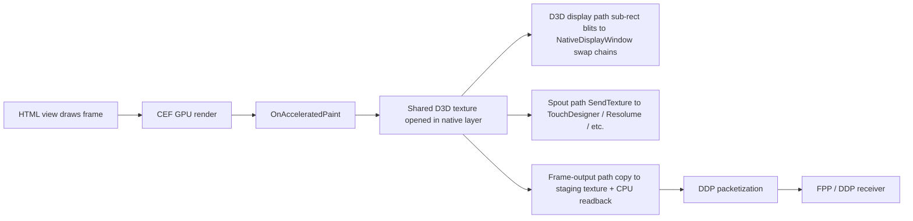
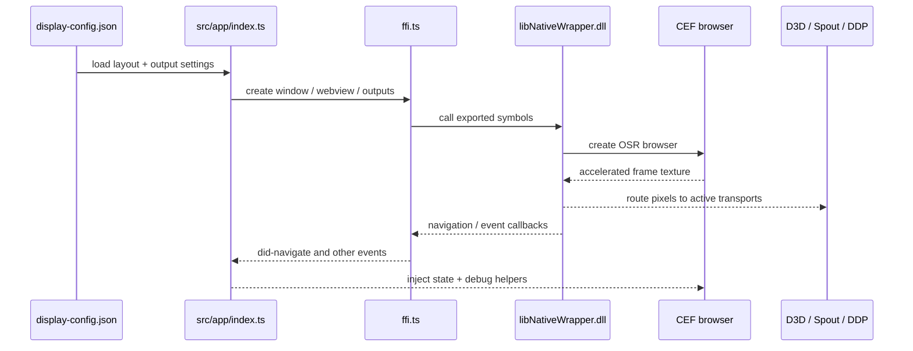
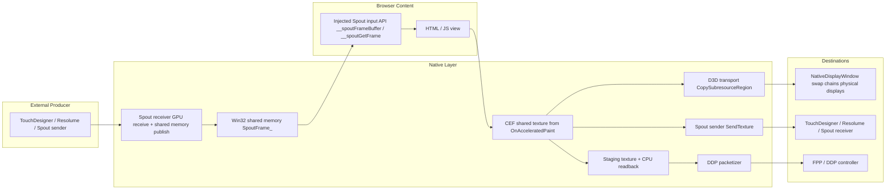
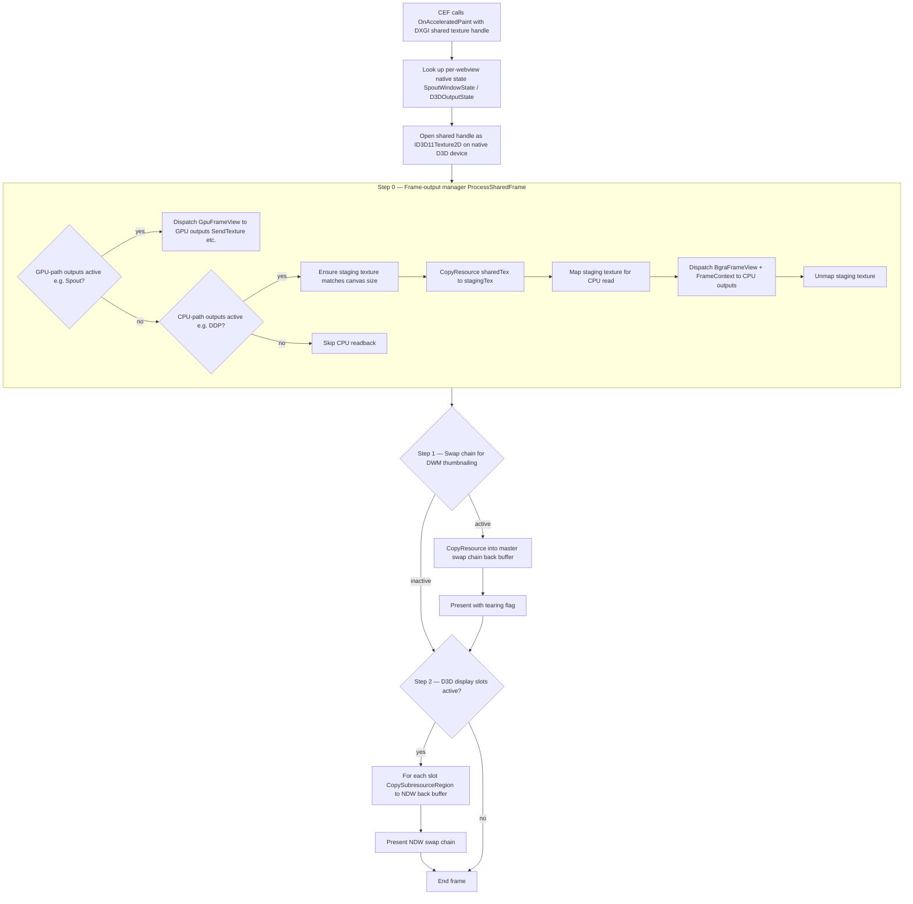

# App Layer Diagram

This page explains the main runtime layers in Chromeyumm and how pixels and control messages move between them.

## Layered View

## What Each Layer Owns

| Layer | Responsibility |
|---|---|
| Browser content | Your installation UI, animation code, shaders, canvases, DOM, media playback |
| CEF OSR | Renders the page offscreen and exposes the GPU texture to the native host |
| TypeScript app | Loads config, creates windows/webviews, registers hotkeys, starts outputs |
| FFI bridge | Typed symbol boundary between Bun/TS and `libNativeWrapper.dll` |
| Native wrapper | Owns Win32 windows, CEF integration, D3D device/context, Spout receiver, accelerated paint hook, D3D display blitting |
| Frame-output module | Owns all transport outputs: GPU-native protocols (Spout sender) and CPU-readback protocols (DDP, etc.). Performs staging readback at most once per frame, shared across CPU-path outputs. |
| Output transports | Move pixels to physical displays, Spout consumers, or network protocols |

## Frame Flow

## Control Flow

## Transport Modes

This view separates the four pixel transport paths that are easy to conflate:

- Spout input: external GPU texture into Chromeyumm, then into browser JavaScript
- Spout output: Chromeyumm-rendered texture out to external GPU consumers
- D3D display output: Chromeyumm-rendered texture out to local display windows
- DDP output: Chromeyumm-rendered texture read back and packetized for network transport

## Reading The Transport Diagram

1. Spout input is the only path that starts outside the app and ends inside the browser content.
2. D3D output, Spout output, and DDP output all start from the same rendered CEF texture.
3. Spout output stays GPU-native — it runs inside the frame-output manager's GPU path, no CPU round-trip.
4. DDP output requires a staging-texture readback (CPU path) before packetization. The readback is done once and shared across all active CPU-path outputs.
5. The HTML view does not send DDP or Spout directly. It only renders pixels or consumes injected input data.
6. All output transports are independent and can be active simultaneously for the same webview.

## OnAcceleratedPaint Internals

This is the lower-level native path inside `native/cef-wrapper.cpp` after CEF hands over an accelerated frame.

## Reading The Native Frame Path

1. The shared texture is the central artifact — every output path branches from the same GPU texture.
2. The frame-output manager (step 0) owns both GPU-native protocols (Spout) and CPU-readback protocols (DDP). It performs at most one staging-texture readback per frame, shared across all active CPU-path outputs.
3. Spout output stays GPU-to-GPU — `SendTexture` inside the frame-output manager, no CPU round-trip.
4. D3D display output (step 2) is separate from the frame-output manager — it uses `CopySubresourceRegion` directly from the shared texture into each NativeDisplayWindow swap chain.
5. All three steps happen on the same frame — Spout, DDP, and D3D multi-window can all be active simultaneously.

## Key Distinction

There are two different "bridges" in this architecture:

1. The control bridge is the FFI boundary between Bun/TypeScript and the native DLL. This is how the app starts windows, outputs, and native services.
2. The graphics bridge is the shared texture path from CEF OSR into the native D3D layer. This is how rendered pixels move efficiently without going through JSON, base64, or browser-side networking.

That distinction matters because Spout and DDP do not originate in the HTML layer directly. The HTML layer only renders pixels. The native layer decides how those pixels are transported onward.

## Related

- [../../ARCHITECTURE.md](../../ARCHITECTURE.md) — System context and primary architecture notes
- [../BACKEND.md](../BACKEND.md) — Native wrapper, FFI, and output implementation details
- [../FRONTEND.md](../FRONTEND.md) — Browser-side view architecture